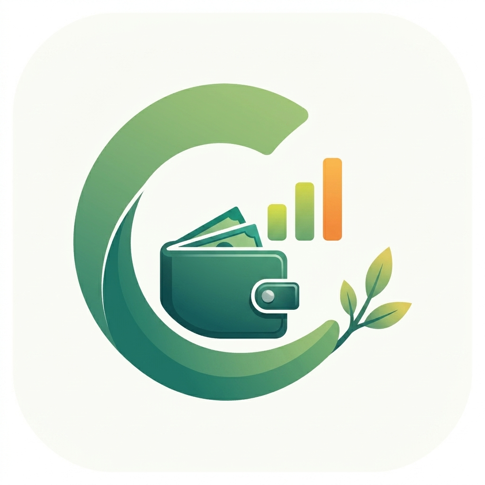

<div align="center">
  
  <h1>coZify</h1>
  <p><strong>Track • Manage • Grow</strong></p>
  <p><em>A premium, local-first personal finance and daily budget tracking application.</em></p>
  
  <p>
    <a href="#-features">Features</a> •
    <a href="#-tech-stack">Tech Stack</a> •
    <a href="#-installation--setup">Installation</a> •
    <a href="#-usage">Usage</a> •
    <a href="#-privacy--architecture">Privacy</a>
  </p>
</div>

---

## 📖 Description
**coZify** is a beautifully designed, high-performance financial companion that helps you track your daily spending, manage multiple accounts, and monitor your overall net worth. Built with an uncompromising focus on UI/UX, coZify combines hardware-accelerated animations, haptic feedback, and a premium glassmorphic aesthetic to make budgeting feel less like a chore and more like a fluid experience. It operates entirely offline-first for maximum privacy, with optional cloud synchronization.

---

## 🚀 Features

### 💰 Daily Budget Engine
- **Circular Burn-Rate Rings**: A visual indicator of your daily spending allowance directly on the dashboard.
- **Instant Top-Ups**: Add to your budget instantly with quick-add chips (+₹50, +₹100) or custom amounts, which automatically log as income.
- **Dynamic Allowances**: Adjust your daily target budget at any time to match your lifestyle.

### 📊 Dynamic Transactions & Analytics
- **Smart Categorization**: Beautiful, color-coded categories with Lucide icons (Food, Transport, Bills, etc.).
- **Custom Categories**: Create your own categories on the fly. The app automatically deduplicates them and assigns deterministic HSL colors.
- **In-Depth Insights**: Toggle between weekly and annual views. Analyze your category breakdowns without income skewing your expense charts.
- **Fluid Gestures**: Swipe-to-delete transactions with native device vibration feedback.

### 💳 Wallets, Cards & Goals
- **Virtual Payment Cards**: Add credit or debit cards with personalized gradients, cardholder names, and expiry dates.
- **Savings Goals**: Set visual milestones with progress tracking and custom glow themes to hit your savings targets.
- **Multi-Account Support**: Switch between multiple user profiles seamlessly on the same device.

### 🎨 Premium Design System
- **7 Core Theme Paradigms**: Switch between Cyberpunk Pink, Neon Emerald, Deep Sapphire, Sunset Gold, Midnight Purple, Slate Minimal, and Arctic Blue.
- **Micro-Motion**: Spring animations, layout transitions, and fluid interactions powered by Framer Motion.
- **Light & Dark Modes**: Fully responsive styling tailored for both premium dark themes and clean editorial light aesthetics.

---

## 🛠 Tech Stack

coZify is built on a modern, robust web stack:
- **Framework**: React 19 + TypeScript
- **Styling**: Tailwind CSS v4, Emotion
- **Animation**: Framer Motion, Tailwind Animate
- **State Management**: Zustand (Local Storage Persistence)
- **UI Components**: Radix UI primitives, Material UI (MUI), Embla Carousel
- **Backend / Sync (Optional)**: Firebase & Firestore
- **Build Tool**: Vite

---

## ⚙️ Installation & Setup

### Prerequisites
Make sure you have [Node.js](https://nodejs.org/) (v18+ recommended) and `npm` installed.

### 1. Clone the repository
```bash
git clone https://github.com/your-username/cozify.git
cd cozify
```

### 2. Install dependencies
```bash
npm install
```

### 3. Setup Firebase (Optional for Cloud Sync)
If you wish to enable cloud synchronization:
1. Create a Firebase project in the [Firebase Console](https://console.firebase.google.com/).
2. Copy `.env.example` to `.env` and fill in your Firebase configuration variables.

### 4. Run the development server
```bash
npm run dev
```
The app will be available at `http://localhost:5173`.

### 5. Build for production
```bash
npm run build
```

---

## 📱 Usage
- **Add an Expense**: Tap the `+` button in the navigation bar to log an expense. Select a category, set the amount, and add an optional note.
- **Review Flow**: Navigate to the **Flow** tab to see a chronological timeline of all your transactions.
- **Check Insights**: Visit the **Insights** tab to review your weekly/yearly charts and understand your spending habits.
- **Profile & Settings**: Head to the **Profile** tab to switch accounts, change your theme, or export a backup of your data.

---

## 🔐 Privacy & Architecture
**Your data belongs to you.** coZify is designed as a **local-first** application. All your transactions, categories, and settings are saved locally on your device via Zustand persistence.
- **Offline Capable**: The app functions fully without an internet connection.
- **Manual Backups**: You can generate full `.json` backups at any time and restore them natively.
- **Cloud Sync**: For cross-device access, you can authenticate via Google and securely synchronize your data to Firebase Firestore.

---

## 📜 License
This project is licensed under the [ISC License](LICENSE).

<p align="center">
  Designed & Developed with ♥ by Mustaq
</p>