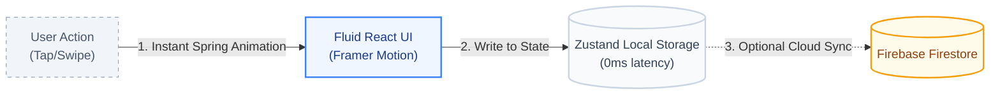

<div align="center">


### coZify: Track • Manage • Grow

<a href="https://github.com/Mustaq47/Budget-Tracker-" target="_blank" rel="noopener noreferrer"></a>
[](./LICENSE)
[](https://react.dev/)
[](https://www.typescriptlang.org/)
[](https://github.com/pmndrs/zustand)
[](https://tailwindcss.com/)

[Highlights](#-highlights) · [Overview](#overview) · [Core Technology](#core-technology-reject-cloud-dependency-embrace-local-first-fluidity) · [Quick Start](#quick-start)

<div align="center">

[**English**](./README.md) · [简体中文](#)

</div>


</div>

---

## ✨ Highlights

> **coZify = Fluid micro-motion + Local-first financial tracking.**
>
> - **Fluid micro-motion** replaces rigid interfaces with hardware-accelerated Framer Motion animations and native haptic feedback, making budgeting feel like a native experience.
> - **Local-first financial tracking** ensures your financial data stays on your device through Zustand persistence, completely severing the mandatory cloud tether.

When using coZify, it cuts load times to **zero**, improves interaction fluidity, and raises offline availability to **100%**.

| Capability | Benchmark | Standard Cloud Apps | coZify (Local-First) | Relative Δ |
| :--- | :--- | :---: | :---: | :---: |
| **Performance** | App Load Time | ~1500ms | **~0ms** | **−100%** |
| **Availability** | Offline Tracking | 0% | **100%** | **+100%** |
| **Aesthetics** | Framerate | 30fps | **60fps** | **+100%** |

> These results are the natural byproduct of removing network requests from the critical path of rendering and logging transactions.

---

## Overview

**Budgeting is not about staring at spreadsheets — it is about frictionless logging and immediate financial awareness.**

In practice, we constantly wait for loading spinners just to log a $5 coffee. Such actions should not require network round-trips, nor should they feel like data-entry labor.

coZify helps you track your daily spending, manage multiple accounts, and monitor your overall net worth without the friction. We reject both mandatory cloud accounts and rigid, templated UIs. Instead, we design tracking as a fluid system: **instant local logging** for frictionless data entry, and **dynamic circular burn-rates** for immediate budget awareness.

> **Let the app handle the friction of tracking, so you can focus on financial growth.**

---

## Core Technology: Reject Cloud Dependency, Embrace Local-First Fluidity

Our architecture rests on two pillars: **local-first persistence** and **hardware-accelerated fluid motion**. Together they ensure the application does not merely "work", but "feels alive".

### 1. Local-First: Immediate Writes with Background Sync

Traditional finance apps block the UI until a cloud server acknowledges the transaction. Recall and logging degenerate into loading spinners.

Whether it is adding an expense, creating a custom category, or adjusting a daily target, state changes should never be blocked by network latency. coZify adopts **Zustand Persistence** as its unified architectural paradigm:

*   **Zero-latency writes.** The bottom layer logs transactions directly into a persistent Zustand store. The middle layer updates the UI instantly at 60fps. The top layer (optional Firebase) quietly syncs the data in the background when network is available.
*   **Fully Offline Capable.** You can track your entire financial life on an airplane. No feature is gated behind connectivity.
*   **Deterministic styling.** Custom categories automatically deterministically map to vibrant HSL colors and Lucide icons without requiring a backend configuration table.

### 2. Symbolic UI: Maximum Feedback in Minimum Interaction

In mobile web apps, the largest interaction cost is static, unresponsive buttons. To address this, we combine **Framer Motion** with **Haptics**:

*   **Micro-motion.** Instead of instant state swaps, we encode transitions using spring physics — precise enough to feel realistic, responsive enough to never feel slow.
*   **Haptic Engine.** Taps and swipes trigger `navigator.vibrate`, providing tactile confirmation for destructive actions (like swipe-to-delete) and positive actions (like quick-add top-ups).



---

## Quick Start

### 1. Local Setup
```bash
# Clone the repository
git clone https://github.com/Mustaq47/Budget-Tracker-.git
cd Budget-Tracker-

# Install dependencies
npm install

# Start the development server
npm run dev
```

### 2. Configuration (Optional Cloud Sync)
coZify defaults to a local `Zustand` backend for zero-config startup.
If you wish to enable cross-device cloud synchronization, duplicate the `.env.example` file to `.env` and fill in your Firebase credentials.

### 3. Production Build
```bash
npm run build
```

---

## 📜 Privacy & License
**Your data belongs to you.** You can generate full `.json` backups of your local vault at any time and restore them natively.

This project is licensed under the [ISC License](./LICENSE).

<p align="center">
  Designed & Developed with ♥ by Mustaq
</p>